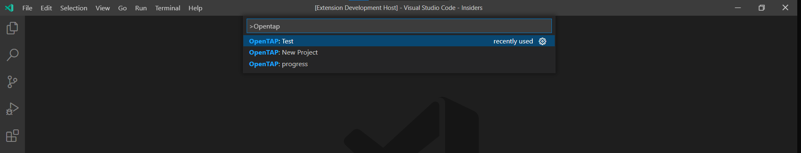

# OpenTAP VSCode SDK README

OpenTAP VSCcode SDK let you create OpenTAP project in the vscode directly.

## Features

This Extension is still under work in progress,

as for now the "New Project" will able to create a project from within the VSCode and add the ".vscode" from , thanks to vssdk tap plugin. Modification are made on the csproj and launch.json 

on .csproj file , AdditionOpenTapPackage is added with Editor (*currently stick to 9.15 -> plan to make it a variable where user can select as part of the creation process)

on launch.json , the debug with the editor is been added.

## Requirements

1 . vssdk (TAP Plugin) - requires vssdk to be installed 
    - future aim is to have the template directly so the file manipulation to insert the AdditionalOpenTapPackage and OpenTapPackageReference can be simplified.

## Extension Settings

## Known Issues

## Release Notes

